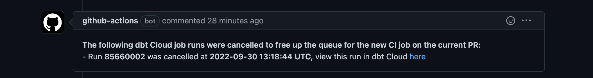

# dbt Cloud Cancel Running CI Job Runs Action


This action checks if a [dbt Cloud](https://cloud.getdbt.com) CI job (based on job ID) is running after a new or updated PR commit is made. If there is a job running or there are job runs that are queued - this action will cancel these running and queued runs since they are likely stale as a new commit to the PR has been made. This allows to always have the newest code commit running in the CI job without having to wait for the stale job runs to finish.


Some scenarios where this is useful:
- You have longer running CI jobs in your dbt Cloud project and you don't want new commits to get queued when they are replacing stale code that is still running in a previous CI job
- You have a large team where there is constant commits/PRs against the code base and you always want the latest job to be run without waiting for older jobs to finish

Future improvement to this action: 
- The ability to set a flag that will only run the action if the commit is against the same PR as a running/queued job. For example, in some cases you may only want to run this action if you made a commit to branch `branch_one` and then 2 minutes made another commit to `branch_one` causing the PR checks to run again. Default behavior with the action today will do this but it will also cancel a CI job running for `branch_one` if someone opens a PR and kicks off a CI job run for `branch_two` which may not be desired in some team workflows. 

___

## **Inputs**

### Credentials

- `dbt_cloud_token` - dbt Cloud [API token](https://docs.getdbt.com/docs/dbt-cloud/dbt-cloud-api/service-tokens)
- `dbt_cloud_account_id` - dbt Cloud Account ID
- `dbt_cloud_job_id` - dbt Cloud Job ID

### Optional Credentials
- `dbt_cloud_host` - the URL of the dbt cloud account with, by default `cloud.getdbt.com` is used

It's recommend to pass sensitive variables as GitHub secrets. [Example article on how to use Github Action secrets](https://www.theserverside.com/blog/Coffee-Talk-Java-News-Stories-and-Opinions/GitHub-Actions-Secrets-Example-Token-Tutorial)

___

## **Outputs**
- `cancelled_jobs_flag` - A returned flag that is outputted as `True` if running/queued job runs were cancelled in order to kick off a CI job for the latest commit. Returns `False` if no job runs were running/queued and therefore didn't need to be cancelled.
- `cancelled_dbt_cloud_job_runs` - A list of dbt Cloud run IDs for the given job that were cancelled in order to kick off a CI job for the latest commit. (e.g. `[85660002, 85660002]`). This is useful for logging. 
- `cancelled_dbt_cloud_job_runs_markdown` - Pre-Scripted markdown containing info on the cancelled jobs, can be used in PR comments. Example of a scenario where 4 job runs where cancelled this is the markdown output:
    ```
    **The following dbt Cloud job runs were cancelled to free up the queue for the new CI job on the current PR:**
    * Run **85519539** was cancelled at **2022-09-29 23:32:44 UTC**, view this run in dbt Cloud [here](https://cloud.getdbt.com/next/deploy/12345/projects/161955/runs/85519539/)
    * Run **85519497** was cancelled at **2022-09-29 23:32:45 UTC**, view this run in dbt Cloud [here](https://cloud.getdbt.com/next/deploy/12345/projects/161955/runs/85519497/)
    * Run **85519494** was cancelled at **2022-09-29 23:32:46 UTC**, view this run in dbt Cloud [here](https://cloud.getdbt.com/next/deploy/12345/projects/161955/runs/85519494/)
    * Run **85519490** was cancelled at **2022-09-29 23:32:46 UTC**, view this run in dbt Cloud [here](https://cloud.getdbt.com/next/deploy/12345/projects/161955/runs/85519490/) 
    ```

___


## **Creating a workflow**
```yaml
# This is a basic workflow to show using this action

# name of the workflow
name: Cancel Running Slim CI Job Runs If New Commit is Made

# Controls when the workflow will run
on:
  pull_request:
    branches: [ "main" ]

  # Allows you to run this workflow manually from the Actions tab if needed
  workflow_dispatch:

# A workflow run is made up of one or more jobs that can run sequentially or in parallel
jobs:

  # This workflow contains a single job called "cancel_running_slim_ci_jobs"
  cancel_running_slim_ci_jobs:
  
    # The type of runner that the job will run on
    runs-on: ubuntu-latest

    # Steps represent a sequence of tasks that will be executed as part of the job
    steps:

      # running the step to cancel another other CI job runs that are running except the latest
      - name: Cancel another other CI runs that are running except the latest run
        id: cancel_stale_ci_runs
        uses: stevedow99/dbt-cloud-dynamic-ci-job-cancel-action@v1.0
        with:
          dbt_cloud_token: ${{ secrets.DBT_CLOUD_TOKEN }}
          dbt_cloud_account_id: 96504
          dbt_cloud_job_id: 130247
```
___
## **Examples of using this Github action with other workflows**

<br>

### Example using workflow to log the cancelled job run IDs:
```yaml


# This is a basic workflow to show using this action

# name of the workflow
name: Cancel Running Slim CI Job Runs If New Commit is Made

# Controls when the workflow will run
on:
  pull_request:
    branches: [ "main" ]

  # Allows you to run this workflow manually from the Actions tab if needed
  workflow_dispatch:

# A workflow run is made up of one or more jobs that can run sequentially or in parallel
jobs:

  # This workflow contains a single job called "cancel_running_slim_ci_jobs"
  cancel_running_slim_ci_jobs:
  
    # The type of runner that the job will run on
    runs-on: ubuntu-latest

    # Steps represent a sequence of tasks that will be executed as part of the job
    steps:

      # running the step to cancel another other CI job runs that are running except the latest
      - name: Cancel another other CI runs that are running except the latest run
        id: cancel_stale_ci_runs
        uses: stevedow99/dbt-cloud-dynamic-ci-job-cancel-action@v1.0
        with:
          dbt_cloud_token: ${{ secrets.DBT_CLOUD_TOKEN }}
          dbt_cloud_account_id: 12345
          dbt_cloud_job_id: 130247
          
      # logging if there was a job run(s) cancelled or not
      - name: Logging if there was a CI run that was cancelled
        if:  steps.cancel_stale_ci_runs.outputs.cancelled_jobs_flag == 'True'
        run: |
          echo "A dbt Cloud CI job run(s) was cancelled due to a new CI run being triggered"
          echo "The following job runs were cancelled ${{ steps.cancel_stale_ci_runs.outputs.cancelled_dbt_cloud_job_runs }}"
      
```
<br>

### Example using workflow to cancel job runs and then post information about the cancelled job runs in a PR comment 

This workflow will produce a PR comment that looks like this job runs are cancelled:




```yaml


# This is a basic workflow to show using this action

# name of the workflow
name: Cancel Running Slim CI Job Runs If New Commit is Made

# Controls when the workflow will run
on:
  pull_request:
    branches: [ "main" ]

  # Allows you to run this workflow manually from the Actions tab if needed
  workflow_dispatch:

# A workflow run is made up of one or more jobs that can run sequentially or in parallel
jobs:

  # This workflow contains a single job called "cancel_running_slim_ci_jobs"
  cancel_running_slim_ci_jobs:
  
    # The type of runner that the job will run on
    runs-on: ubuntu-latest

    # Steps represent a sequence of tasks that will be executed as part of the job
    steps:

      # running the step to cancel another other CI job runs that are running except the latest
      - name: Cancel another other CI runs that are running except the latest run
        id: cancel_stale_ci_runs
        uses: stevedow99/dbt-cloud-dynamic-ci-job-cancel-action@v1.0
        with:
          dbt_cloud_token: ${{ secrets.DBT_CLOUD_TOKEN }}
          dbt_cloud_account_id: 12345
          dbt_cloud_job_id: 130247
          
      # logging if there was a job run(s) cancelled or not
      - name: Logging if there was a CI run that was cancelled
        if:  steps.cancel_stale_ci_runs.outputs.cancelled_jobs_flag == 'True'
        run: |
          echo "A dbt Cloud CI job run(s) was cancelled due to a new CI run being triggered"
          echo "The following job runs were cancelled ${{ steps.cancel_stale_ci_runs.outputs.cancelled_dbt_cloud_job_runs }}"
          
      # if there a job run(s) was cancelled, we grab the outputted markdown and put it into a PR comment for logging
      - name: PR comment with Job Run Cancelation Information
        uses: mshick/add-pr-comment@v1
        if:  steps.cancel_stale_ci_runs.outputs.cancelled_jobs_flag == 'True'
        with:
          message: |
            ${{ steps.cancel_stale_ci_runs.outputs.cancelled_dbt_cloud_job_runs_markdown }}
          repo-token: ${{ secrets.GITHUB_TOKEN }}
          repo-token-user-login: 'github-actions[bot]'
          allow-repeats: false # This is the default
      
```
